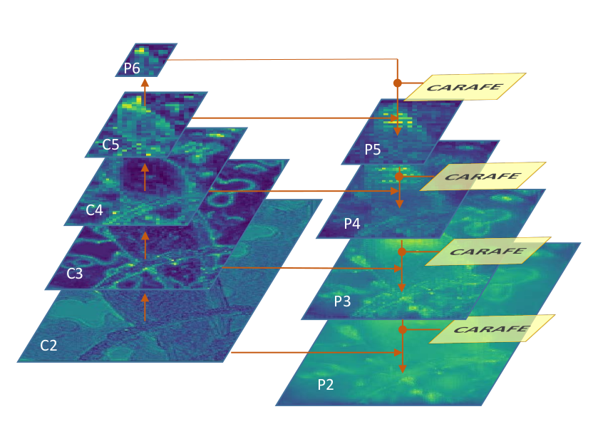

## 与以往操作模块的关系
过去的工作中有一些操作模块虽然目标不尽相同，但是与本文有着相似的设计哲学。
- [Dynamic Filter](): 依据输入生成instance-specific的卷积核。与本文相同都是content-aware的。
主要区别在于卷积核的生成上。Dynamic Filter对于每个位置预测$C \mul C \mul C \mul K \mul K$大小的参数；
而本文由于只关注特征的空间而不处理深度，只需要预测$K \mul K$大小的参数。于是本文方法会非常的高效。
- [Spatial Attention](): 空间注意力模块会预测一张与输入相同大小的注意力图，然后依据注意力的权重调整特征图上的每个像素。
本文的reassembly模块则是使用了每个像素周围的一个局部区域进行加权和。Spatial Attention可以看作本文方法的一种特例。
- [Spatial Transformer Networks](): STN会对输入预测一个整图的参数化的变换矩阵，利用这个变换矩阵可微地形变输入。
但是整图服从单一变化的假设在空间变化很复杂的时候是不合理的，并且STN也非常难以训练。
- [Deformable Convolutional Networks](): DCN也用了学习几何变换的思路。它会对输入预测卷积核每个输入点的位置偏移。
这个方法会引入很多的参数，并且训练时对于参数初始化非常敏感。

## CARAFE的应用与实验
除非特殊说明，本文默认的CARAFE超参数为$C_m = 64, k_{encoder} = 3, k_{up} = 5$。

### 应用1： 物体检测、实例分割
在物体检测、实例分割中，Feature Pyramid Network(FPN)是非常重要的模块。
其中top-down中包含了多次上采样的操作，均可以直接替换为本文的CARAFE。其结构如下图所示。
Mask R-CNN中在生成实例的mask时最后使用了一个上采样层来提升四倍的分辨率，也可以替换为CARAFE。

### 应用2： 语义分割
Uper-Net是语义分割中非常强的baseline，在三个模块中使用到了上采样：PPM, FPN, FUSE.
- PPM（Pyramid Pooling Module)

- FPN与前述相同

- FUSE (Multi-level Feature Fusion)

### 应用3： 图像填充
图像填充中经常使用到U-net的结构，包含多次上采样操作，都可以替换成CARAFE。
